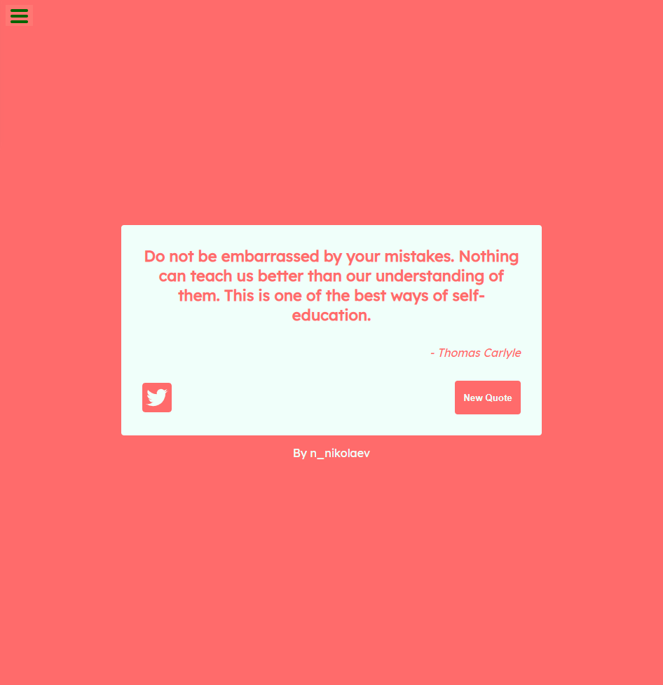
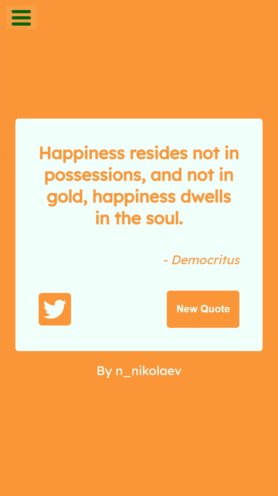

# Random Quote Machine

The following application is a quote machine that pulls random quotes from [Quotable API](https://github.com/lukePeavey/quotable) and is built using [Parcel](https://parceljs.org/), [Sass](https://sass-lang.com/) and [ReactJS](https://reactjs.org/). 

## Motivation
This project was made for the [Front End Development Libraries Certification on Free Code Camp](https://www.freecodecamp.org/learn/front-end-libraries/front-end-libraries-projects/build-a-random-quote-machine).

## Table of contents

- [Overview](#overview)
  - [The challenge](#the-challenge)
  - [Screenshot](#screenshot)
  - [Links](#links)
  - [Features](#features)
- [Getting started](#getting-started)
  - [Prerequisites](#prerequisites)
  - [Installation](#installation)
  - [Built with](#built-with)
  - [License](#license)
- [Author](#author)
- [Acknowledgments](#acknowledgments)

## Overview

### The challenge

Users should be able to:

- [x] View the optimal layout depending on their device's screen size

- [x] See a random quote displayed upon first load

- [x] Display a new quote upon clicking the "New Quote" button

- [x] Tweet a quote by using the `twitter.com/intent/tweet` path

### Screenshot

**Desktop View**



**Mobile View**



### Links

- Project URL: [Github Repository](https://github.com/N-Nikolaev/random-quote-machine)
- Live App URL: [Github Page](https://n-nikolaev.github.io/random-quote-machine)

### Features

The design of the project was taken from the sample project provided by Free Code Camp as an example output and includes some features not included with the sample project, these include:

- The application was built from scratch using ReactJS
- Parcel was used to bundle all the files to reduce file size
- The quotes we retrieved using the [Fetch API](https://developer.mozilla.org/en-US/docs/Web/API/Fetch_API) from the ["Quotable" API](https://github.com/lukePeavey/quotable)
- Uses CSS variables to change the theming of the application
- Displays a loading animation for the first API request
- And is mobile responsive

## Getting started

### Prerequisites

You are going to need the latest version of NPM in order to install this project on your machine.
* npm
  ```sh
  npm install npm@latest -g
  ```
  
### Installation

1. Clone the repository
   ```sh
   git clone https://github.com/N-Nikolaev/random-quote-machine.git
   ```
2. Install NPM packages
   ```sh
   npm install
   ```

### Built with

- Semantic HTML5 markup
- CSS custom properties
- CSS Grid
- Mobile-first workflow
- [SASS](https://sass-lang.com/) - CSS Preprocessor
- [Parcel](https://parceljs.org/) - Web Application Bundler
- [ReactJS](https://reactjs.org/) - JavaScript Library / Framework
- [FontAwesome](https://fontawesome.com/) - Icon toolkit
- [Quoteable API](https://github.com/lukePeavey/quotable) - Open source quote API
- [Favicon.io](https://favicon.io/) - Favicon generator

### License

Distributed under the MIT License. See `LICENSE` for more information.

### Useful resources

1. [FCC - Random Quote Machine Example Project](https://codepen.io/freeCodeCamp/full/qRZeGZ)
2. [Why you should be using Parcel.js for React, Sass, CSS, Vue, and more](https://www.youtube.com/watch?v=sIXxgnEYsQc)
3. [Add SASS to React](https://medium.com/nerd-for-tech/add-sass-to-your-react-app-in-2021-here-is-how-c7260c323a5a)
4. [Add SASS to a barebones React project](https://www.freecodecamp.org/news/how-to-up-a-react-app-with-parcel/)
5. [Fetching Data with React Hooks useEffect](https://www.youtube.com/watch?v=qdCHEUaFhBk)
6. [React hooks fetch data](https://www.youtube.com/watch?v=qdCHEUaFhBk)
7. [Dark theme in a day](https://mwichary.medium.com/dark-theme-in-a-day-3518dde2955a)
8. [Call Parent Function from Child Component](https://www.youtube.com/watch?v=QmZ5baNgZLc)
9. [Best README Template](https://github.com/othneildrew/Best-README-Template)

## Author

- Github - [Nikolay Nikolaev](https://github.com/N-Nikolaev)
- Frontend Mentor - [@N-Nikolaev](https://www.frontendmentor.io/profile/N-Nikolaev)

## Acknowledgments

- [Free Code Camp](https://www.freecodecamp.org/learn)
- [ReactJS](https://reactjs.org/)
- [Parcel](https://parceljs.org/)
- [SASS](https://sass-lang.com/)
- [FontAwesome](https://fontawesome.com/)
- [Quoteable API](https://github.com/lukePeavey/quotable)
- [Favicon.io](https://favicon.io/)
- [Flatuicolors](https://flatuicolors.com/)
- [Medium - @sroskelly](https://medium.com/@sroskelley)
- [Medium - Marcin Wichary](https://mwichary.medium.com/)
- [CodingEntrepreneurs](https://www.youtube.com/channel/UCWEHue8kksIaktO8KTTN_zg)
- [The Net Ninja](https://netninja.dev/)
- [Frontendmentor.io](https://frontendmentor.io/)
- [@othneildrew](https://github.com/othneildrew)
